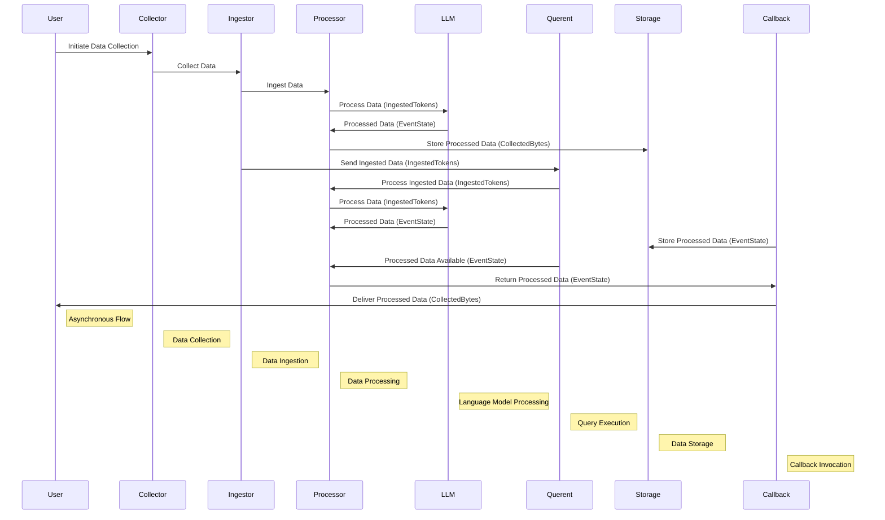

# Querent Research Repository 

The Asynchronous Data Dynamo and Graph Neural Network Catalyst


## Unlock Insights, Asynchronous Scaling, and Forge a Knowledge-Driven Future

🚀 **Asynchronous Processing**: Querent excels in handling data from multiple sources concurrently with asynchronous processing, eliminating bottlenecks and maximizing efficiency.

💡 **Effortless Knowledge Graph Construction:**: Querent's robust architecture simplifies building comprehensive knowledge graphs, enabling you to uncover hidden data relationships.

🌐 **Seamless Scalability**: Easily scale your data operations with Querent's horizontal scaling capabilities, allowing for the smooth processing of multiple data streams.

🔍 **Data-Driven Insights**: Extract actionable information and make data-informed decisions with ease.

🧠 **Advanced Language Model Utilization**: Utilize state-of-the-art language models (LLMs) for natural language processing tasks, enabling Querent to tackle complex text-based challenges.

📈 **Memory-Efficient Framework**: Querent is designed to handle large datasets economically, using memory-efficient techniques to ensure optimal performance even under memory constraints.

## Table of Contents

- [Querent](#querent)
  - [Unlock Insights, Asynchronous Scaling, and Forge a Knowledge-Driven Future](#unlock-insights-asynchronous-scaling-and-forge-a-knowledge-driven-future)
  - [Table of Contents](#table-of-contents)
  - [Introduction](#introduction)
  - [Features](#features)
  - [Usage](#usage)
  - [Configuration](#configuration)
  - [Querent: an asynchronous engine for LLMs](#querent-an-asynchronous-engine-for-llms)
  - [Getting Started](#getting-started)
    - [Prerequisites](#prerequisites)
    - [Installation](#installation)
    - [Setup DB](#setup-db)
    - [Example](#example)
  - [Perform Similarity Search](#performing-similarity-search)
  - [Graph Traversal](#traversing-the-data)
  - [Benefits](#additional-benefits)
  - [Contributing](#contributing)
  - [License](#license)
  

## Introduction

Querent is designed to simplify and optimize data collection and processing workflows. Whether you need to ingest files, preprocess text, or create complex knowledge graphs from local data, Querent offers a flexible framework for building and scaling these processes.

## Features

- **Collectors:** Gather local data from file sources asynchronously.

- **Ingestors:** Process collected data efficiently with custom transformations and filtering.

- **Processors:** Apply asynchronous data processing, including text preprocessing, cleaning, and feature extraction.

- **Engines:** Leverage a Language Model (LLM) engine to convert textual data into knowledge triples (Subject, Predicate, Object) based on attention matrix scores.

- **Storage:** Store processed data in a PostgreSQL storage system.


## Usage

Querent provides a flexible framework that adapts to your specific data collection and processing needs. Here's how to get started:

1. **Configuration:** Set up collector, ingestor, and processor configurations as needed.

2. **Collecting Data:** Implement collector classes to gather data from chosen sources. Handle errors and edge cases gracefully.

3. **Processing Data:** Create ingestors and processors to clean, transform, and filter collected data. 

4. **Storage:** Choose your storage system (e.g., databases) and configure connections. Store processed data efficiently.


## Configuration

Querent relies on configuration files to define how collectors, ingestors, and processors operate. These files are typically located in the `config` directory. Ensure that you configure the components according to your project's requirements.

## Querent: an asynchronous engine for LLMs

**Sequence Diagram:** *Asynchronous Data Processing in Querent*



## Getting Started

Let's get Querent up and running on your local machine.

### Prerequisites

- Python 3.9+
- Virtual environment (optional but recommended)

### Installation

1. Create a virtual environment (recommended):

   ```bash
   python -m venv venv
   source venv/bin/activate  # On Windows, use `venv\Scripts\activate`
   ```
2. Install latest Querent Workflow Orchestrator package:

   ```bash
   pip install querent
   ```
  
3. Install the project dependencies:

   ```bash
     python3 -m spacy download en_core_web_lg
   ```

4. Apt install the project dependencies:
   ```bash
        sudo apt install tesseract-ocr
        sudo apt install libtesseract-dev
        sudo apt-get install ffmpeg
        sudo apt install antiword
    ```
5. Install torch
    ```
    pip install torch
    ```
6. Install Docker : Refer to the [official documentation](https://docs.docker.com/engine/install/)

### Setup DB

1. **Download the docker compose file** - [Postgres docker compose file.](tests/tutorial/docker-compose.yaml)

2. **Run Postgres Instance** - Navigate to the directory where the docker compose file is downloaded. Execute the below:

```bash
    docker compose up
```

### Example

1. **Download the example file with fixed entities** - [Example file.](tests/tutorial/example_fixed_entities.py). Then also download the [example pdf](tests/data/readme_assets/example.pdf) and place it in a directory.

2. **Run the example file** - This script will load the BERT-based embedding model to extract attention weights. The algorithm is designed to identify semantic triples in the data. In the example.py file above, users should modify the script to change the directory where the `example.pdf` file is stored. If running on personal files, modify the fixed entities and their respective types. This will create semantic triples (Subject, Predicate, Object) based on user-provided data. Execute the below:

```python
    python3 example_fixed_entities.py
```


3. **Example Output** - Two tables are initialized when the above script is run

- **Metadata table** - 

| id | event_id                             | subject  | subject_type | predicate | object | object_type | sentence                                                                                                                                                                                                                                                                                                                                                            | file                                                                     | doc_source                                                          | score   |
|----|--------------------------------------|----------|--------------|-----------|--------|-------------|--------------------------------------------------------------------------------------------------------------------------------------------------------------------------------------------------------------------------------------------------------------------------------------------------------------------------------------------------------------------|--------------------------------------------------------------------------|---------------------------------------------------------------------|---------|
| 1  | 298b4df3-a2f1-4721-b78d-9099309257c2 | coach    | person       | athlete   | health | method      | coach torres, with her innovative approach to student-athlete health and her emphasis on holistic training methods, has significantly influenced the physical and mental preparedness of greenwood's athletes. | /home/user/querent-main/readme_assets/example.pdf | file:///home/user/querent-main/readme_assets | 0.159262 |


- **Embedding table** - 

| id | event_id                             | embeddings                                                                                                                            |
|----|--------------------------------------|--------------------------------------------------------------------------------------------------------------------------------------|
| 1  | 298b4df3-a2f1-4721-b78d-9099309257c2 | [-0.00637318,0.0032276064,-0.016642869,0.018911008,-0.004372431,0.035932742,0.010418983,-0.00960234,0.009969827,-0.021499356,...] |


## Performing Similarity Search

Users can perform similarity searches in the embedding table to find relevant documents based on the vector embeddings. Here’s how you can do it:

1. Convert your query into a vector embedding using the same embedding model used for creating the embeddings in the embedding table.

2. Find similar matches: Perform a similarity search in the embedding table to find the top N similar embeddings.

3. Retrieve relevant data: Use the `event_id` from the similar embeddings to fetch the corresponding data from the metadata table.

This approach is highly useful when dealing with thousands of files, as it essentially creates pointers to knowledge, making it easy to retrieve relevant information efficiently.

## Traversing the Data
Querent allows you to traverse the data using SQL queries, enabling you to explore inward and outward edges from either the subject or object. Here’s how:

1. Get Outward Edges: Find all relationships where a given entity is the subject.
```sql
SELECT * FROM public.metadata
WHERE subject = 'your_entity';
```

2. Get Inward Edges: Find all relationships where a given entity is the object.
```sql
SELECT * FROM public.metadata
WHERE object = 'your_entity';
```
3. Find Shortest Path Based on Score: Use recursive queries to find the shortest path between entities based on the score.
```sql
WITH RECURSIVE Path (id, event_id, subject, object, score, path, depth) AS (
  SELECT id, event_id, subject, object, score, ARRAY[subject, object]::VARCHAR[], 1
  FROM public.metadata
  WHERE subject = 'start_entity'
  UNION ALL
  SELECT m.id, m.event_id, m.subject, m.object, p.score + m.score, p.path || m.object, p.depth + 1
  FROM metadata m
  JOIN Path p ON m.subject = p.object
  WHERE p.depth < 10  -- Limit depth to prevent infinite recursion
    AND NOT (m.object = ANY(p.path))  -- Avoid cycles
)
SELECT *
FROM Path
WHERE 'end_entity' = ANY(path)
ORDER BY score ASC
LIMIT 1;
 1;

```


## Additional Benefits

1. Preparing Factual Data: The extracted triples can be used to prepare factual data for fine-tuning or training large language models (LLMs).

2. GNN Use Cases: Graph Neural Networks (GNNs) can utilize the relationships and entities extracted to perform downstream tasks such as link prediction, node classification, and more.

3. AI Use Cases: Enable advanced AI functionalities like cross-document summarization, entity recognition, and trend analysis across a large corpus of documents.

4. Replacing the Need for a dedicated Graph Database: By using PostgreSQL and the embedded vectors, you can achieve efficient graph traversal and relationship mapping without the overhead of a dedicated graph database. This reduces complexity and cost.

5. Scalability: This method scales well with the number of documents, making it suitable for large datasets.

This system not only enhances data retrieval and analysis but also provides a robust foundation for various AI and machine learning applications.

## Contributing

Contributions to Querent are welcome! Please follow our [contribution guidelines](CONTRIBUTING.md) to get started.

## License

This project is licensed under the BSL-1.1 License - see the [LICENSE](LICENCE) file for details.
