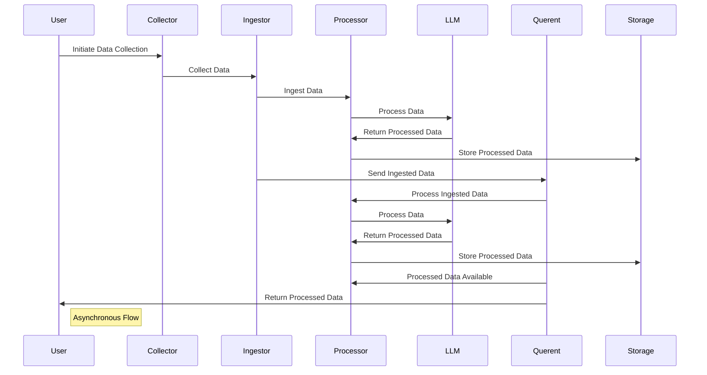

# Querent

The Asynchronous Data Dynamo and Graph Neural Network Catalyst 

*Unlock Insights, Asynchronous Scaling, and Forge a Knowledge-Driven Future*


🚀 **Async at its Core**: Querent thrives in an asynchronous world. With asynchronous processing, we handle multiple data sources seamlessly, eliminating bottlenecks for utmost efficiency.

💡 **Knowledge Graphs Made Easy**: Constructing intricate knowledge graphs is a breeze. Querent's robust architecture simplifies building comprehensive knowledge graphs, enabling you to uncover hidden data relationships.

🌐 **Scalability Redefined**: Scaling your data operations is effortless with Querent. We scale horizontally, empowering you to process multiple data streams without breaking a sweat.

🔬 **GNN Integration**: Querent seamlessly integrates with Graph Neural Networks (GNNs), enabling advanced data analysis, recommendation systems, and predictive modeling.

🔍 **Data-Driven Insights**: Dive deep into data-driven insights with Querent's tools. Extract actionable information and make data-informed decisions with ease.

🧠 **Leverage Language Models**: Utilize state-of-the-art language models (LLMs) for text data. Querent empowers natural language processing, tackling complex text-based tasks.

📈 **Efficient Memory Usage**: Querent is mindful of memory constraints. Our framework uses memory-efficient techniques, ensuring you can handle large datasets economically.

## Table of Contents

- [Querent](#querent)
  - [Table of Contents](#table-of-contents)
  - [Introduction](#introduction)
  - [Features](#features)
  - [Getting Started](#getting-started)
    - [Prerequisites](#prerequisites)
    - [Installation](#installation)
  - [Usage](#usage)
  - [Configuration](#configuration)
  - [Contributing](#contributing)
  - [License](#license)

## Introduction

Querent is designed to simplify and optimize data collection and processing workflows. Whether you need to scrape web data, ingest files, preprocess text, or create complex knowledge graphs, Querent offers a flexible framework for building and scaling these processes.

## Features

- **Collectors:** Gather data from various sources asynchronously, including web scraping and file collection.

- **Ingestors:** Process collected data efficiently with custom transformations and filtering.

- **Processors:** Apply asynchronous data processing, including text preprocessing, cleaning, and feature extraction.

- **Storage:** Store processed data in various storage systems, such as databases or cloud storage.

- **Workflow Management:** Efficiently manage and scale data workflows with task orchestration.

- **Scalability:** Querent is designed to scale horizontally, handling large volumes of data with ease.

## Getting Started

Let's get Querent up and running on your local machine.

### Prerequisites

- Python 3.9+
- Virtual environment (optional but recommended)

### Installation

1. Clone the Querent repository:

   ```bash
   git clone https://github.com/querent-ai/querent-ai.git
   cd querent
   ```

2. Create a virtual environment (recommended):

   ```bash
   python -m venv venv
   source venv/bin/activate  # On Windows, use `venv\Scripts\activate`
   ```

3. Install the project dependencies:

   ```bash
   pip install -r requirements.txt
   ```

## Usage

Querent provides a flexible framework that adapts to your specific data collection and processing needs. Here's how to get started:

1. **Configuration:** Set up collector, ingestor, and processor configurations as needed.

2. **Collecting Data:** Implement collector classes to gather data from chosen sources. Handle errors and edge cases gracefully.

3. **Processing Data:** Create ingestors and processors to clean, transform, and filter collected data. Apply custom logic to meet your requirements.

4. **Storage:** Choose your storage system (e.g., databases) and configure connections. Store processed data efficiently.

5. **Task Orchestration:** For large tasks, implement a task orchestrator to manage and distribute the workload.

6. **Scaling:** To handle scalability, consider running multiple instances of collectors and ingestors in parallel.

7. **Monitoring:** Implement monitoring and logging to track task progress, detect errors, and ensure smooth operation.

8. **Documentation:** Maintain thorough project documentation to make it easy for others (and yourself) to understand and contribute.

## Configuration

Querent relies on configuration files to define how collectors, ingestors, and processors operate. These files are typically located in the `config` directory. Ensure that you configure the components according to your project's requirements.

## Querent: an asynchronous engine for LLMs

**Sequence Diagram:** *Asynchronous Data Processing in Querent*



## Ease of Use

With Querent, creating scalable workflows with any LLM is just a few lines of code.

```python
import asyncio
import pytest
from querent.common.types.querent_queue import QuerentQueue
from querent.llm.base_llm import BaseLLM
from querent.napper.querent import Querent
from querent.napper.resource_manager import ResourceManager

# Create input and output queues
input_queue = QuerentQueue()
output_queue = QuerentQueue()
resource_manager = ResourceManager()

# Define a simple mock LLM class for testing
class MockLLM(BaseLLM):
    async def process_tokens(self, data):
        return f"Processed: {data.data[0]}"

    def validate(self):
        return True

@pytest.mark.asyncio
async def test_querent_with_base_llm():
    # Put some input data into the input queue
    input_data = ["Data 1", "Data 2", "Data 3", None]
    for data in input_data:
        await input_queue.put(data)
    
    # Create a list of mock LLM instances
    num_llms = 1
    llms = [MockLLM(input_queue, output_queue) for _ in range(num_llms)]

    # Create a Querent instance
    querent = Querent(llms, num_workers=num_llms, resource_manager=resource_manager)

    # Start the Querent
    await querent.start()

    # Check the output queue for results and store them in a list
    results = []
    async for result in output_queue:
        results.append(result)

    # Assert that the results match the expected output
    expected_output = [
        "Processed: Data 1",
        "Processed: Data 2",
        "Processed: Data 3",
    ]
    assert results == expected_output
```

## Contributing

Contributions to Querent are welcome! Please follow our [contribution guidelines](CONTRIBUTING.md) to get started.

## License

This project is licensed under the BSL-1.1 License - see the [LICENSE](LICENCE) file for details.
