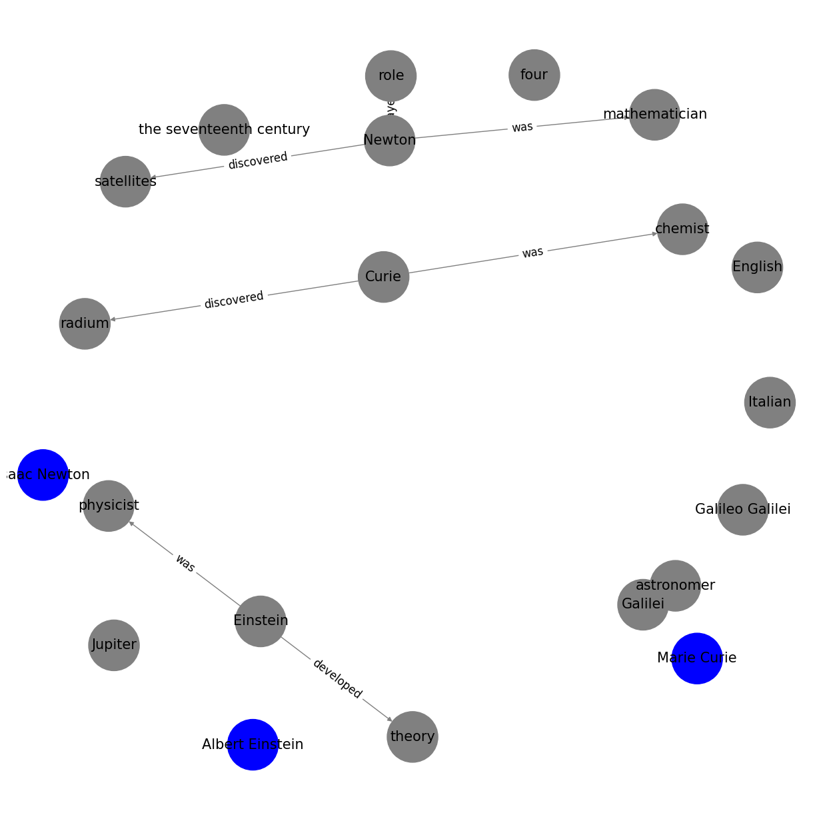

# Relatiionship Extraction Doc

## Context and Scope

Relationship extraction is the process of identifying and classifying semantic relationship types between entities in text. While entity recognition identifies individual entities, it seeks to discern the intricate relationships and associations between identified entities within a text. For our project, we aim to harness the capabilities of cutting-edge language models and tools, such as spaCy, BERT, and LLAMA2, to extract relationships from vast datasets.

Understanding relationships between entities is crucial for a holistic comprehension of textual data. It allows us to map out connections, hierarchies, and dependencies, providing a richer context and a more detailed landscape of the information.

**Importance**: 
- **Knowledge Graphs**: Extracted relationships can be used to populate knowledge graphs, providing a visual representation of entities and their interconnections.
- **Information Retrieval**: Enhances search systems by allowing users to query based on relationships between entities.
- **Semantic Analysis**: Offers a deeper understanding of text, moving beyond individual entities to how they interact and relate.

**Challenges**:
- **Ambiguity**: Texts can be ambiguous, making it challenging to discern the exact nature of a relationship.
- **Complexity**: Some relationships are implicit and require a deeper semantic understanding of the text.


To address the challenges and harness the potential of relationship extraction, our approach will be multi-faceted:

1. **Use of Pre-trained Models**: Leverage models like BERT, OpenAI's GPT series or LLAMA2, which have been trained on vast corpora and can capture intricate semantic relationships.
  
2. **Fine-tuning**: Customize these models on relationship-specific datasets to enhance their extraction capabilities.

3. **Rule-based Systems**: For explicit relationships, employ rule-based systems that utilize patterns and heuristics to identify relationships.

4. **Integration with NER**: Combine relationship extraction with our previous entity extraction efforts. By understanding entities in a text, we can better discern their relationships.

5. **Evaluation**: Continuously evaluate the performance of our relationship extraction system on benchmark datasets and real-world texts to ensure accuracy and reliability.

By adopting this approach, we aim to create a robust system capable of extracting meaningful relationships from texts, paving the way for richer semantic analysis and knowledge representation.

You can directly paste the above Markdown content into your GitHub README. This provides a comprehensive overview of relationship extraction, its significance, challenges, and a proposed approach to tackle it.


Upon concluding this document, readers will possess a thorough grasp of our relationship extraction methodology, its integral components, and its prowess in deciphering and mapping relationships within extensive textual datasets.

## Proposal

We propose an advanced system tailored to extract and understand relationships from a myriad of data sources. By amalgamating best-in-class tools and innovative strategies, our objective is to design a pipeline that not only identifies entities but also deciphers the underlying relationships between them. This foundational knowledge will be pivotal for subsequent phases, particularly when visualizing and analyzing relationship graphs and networks.


### Relationship Extraction Pipeline
- [Selecting the LLM and decide if fine-tuning is needed](#finetuning)
- [Relationship Extraction](#relationshipextraction)


# **Selecting the LLM and decide if fine-tuning is needed** <a id='finetuning'></a>
- [ ] Need to whether choice of model is freemium

1. **Using spaCy :**

spaCy, a leading library in NLP, offers a suite of tools not only for entity recognition but also for parsing the syntactic structure of a sentence. By leveraging spaCy's dependency parsing, we can identify relationships between entities based on the syntactic dependencies in a sentence.

For instance, in the sentence "Steve Jobs founded Apple," we can identify "Steve Jobs" and "Apple" as entities. Using dependency parsing, we can determine that "Steve Jobs" is the subject, "founded" is the verb (or the relationship), and "Apple" is the object. This allows us to extract the relationship "founded" between "Steve Jobs" and "Apple."


To extract relationships using spaCy, we'll leverage its dependency parsing capabilities. Here's a step-by-step guide with the accompanying code:

```python
# Import necessary libraries
import spacy

# Load the large English model from spaCy
nlp = spacy.load("en_core_web_lg")

def extract_relations(doc):
    relations = []
    last_named_entity = None

    for token in doc:
        # Keep track of last named entity
        if token.ent_type_ in ['PERSON', 'ORG']:
            last_named_entity = token.text

        # Pattern: "X was a Y"
        if token.dep_ == "attr":
            verb = token.head
            subject = [child for child in verb.children if child.dep_ == "nsubj"]

            if subject:
                relations.append((subject[0].text, verb.text, token.text))
                print("Extracted relation (X was a Y):", relations[-1])

        # Pattern: "X verb Y"
        if token.dep_ == "dobj":
            object = token.text
            subject = ' '.join([child.text for child in token.head.children if "subj" in child.dep_ and not child.is_punct])

            # If the subject is a pronoun, try to replace with the last named entity
            if subject.lower() in ['he', 'she', 'it'] and last_named_entity:
                subject = last_named_entity

            if subject:
                relation = (subject, token.head.text, object)
                relations.append(relation)
                print("Extracted relation (X verb Y):", relation)

    return relations

doc = nlp("Albert Einstein was a theoretical physicist. He developed the theory of relativity. Marie Curie was a chemist and physicist. She discovered radium and polonium. Isaac Newton was an English mathematician, physicist, and astronomer. He is famous for his laws of motion and the law of universal gravitation. Galileo Galilei was an Italian astronomer. He played a major role in the scientific revolution of the seventeenth century. He discovered Jupiter's four largest satellites.")

relations = extract_relations(doc)

```



2. **Using BERT :**

BERT (Bidirectional Encoder Representations from Transformers) has revolutionized the NLP landscape with its deep bidirectional context and pre-trained embeddings. While it's primarily known for tasks like text classification and question-answering, it can be adeptly fine-tuned for relationship extraction.

### How BERT Facilitates Relationship Extraction:

- **Deep Contextual Embeddings**: BERT's bidirectional nature allows it to understand the context from both preceding and following words. This is crucial for discerning relationships where context plays a pivotal role.

- **Transfer Learning**: BERT is pre-trained on a massive corpus, capturing a wide array of linguistic patterns. By fine-tuning BERT on relationship extraction datasets, we can leverage this knowledge and specialize the model for our task.

- **Attention Mechanism**: BERT's transformer architecture uses attention mechanisms to weigh the importance of different words when predicting a particular token. This is especially useful in relationship extraction where the relationship between two entities might be influenced by other words in the sentence.

### Sample Approach using BERT:

1. **Data Preparation**: Convert the relationship extraction task into a classification problem. For a pair of entities in a sentence, the model predicts the type of relationship (or no relationship).

2. **Fine-tuning BERT**: Use a labeled dataset for relationship extraction to fine-tune BERT. Each input instance will consist of a sentence and two entities, and the model will be trained to predict the relationship label.

3. **Prediction**: For a given sentence and entity pair, feed the input into the fine-tuned BERT model to predict the relationship type.

```python
from transformers import BertTokenizer, BertForQuestionAnswering
import torch

# Load pre-trained BERT model and tokenizer
model_name = "bert-large-uncased-whole-word-masking-finetuned-squad"
model = BertForQuestionAnswering.from_pretrained(model_name)
tokenizer = BertTokenizer.from_pretrained(model_name)

def extract_relationship(document, entity1, entity2, max_length=512):
    """
    Extracts the relationship between two entities in a given document.

    Parameters:
    - document (str): The text/document in which to find the relationship.
    - entity1 (str): The first entity.
    - entity2 (str): The second entity.
    - max_length (int): The maximum token length for BERT input. Default is 512.

    Returns:
    - str: The extracted relationship or 'Unknown' if not found.
    """

    # Frame the relationship extraction as a question
    question = f"What is the relationship between {entity1} and {entity2}?"

    # Tokenize input
    inputs = tokenizer.encode_plus(question, document, add_special_tokens=True, max_length=max_length, truncation=True, return_tensors="pt")
    input_ids = inputs["input_ids"].tolist()[0]

    # Get answer from BERT
    outputs = model(**inputs)
    answer_start_scores = outputs.start_logits
    answer_end_scores = outputs.end_logits
    answer_start = torch.argmax(answer_start_scores)
    answer_end = torch.argmax(answer_end_scores) + 1

    # Convert tokens to string
    answer = tokenizer.convert_tokens_to_string(tokenizer.convert_ids_to_tokens(input_ids[answer_start:answer_end]))

    return answer if answer else "Unknown"

# Example usage:
document = "Apple Inc. is an American multinational technology company that designs, manufactures, and markets smartphones, including the iPhone. Steve Jobs was one of the co-founders of Apple."
entity_pairs = [("Apple Inc.", "iPhone"), ("Steve Jobs", "Apple Inc.")]

for entity1, entity2 in entity_pairs:
    relationship = extract_relationship(document, entity1, entity2, max_length=256)  # Here, we set max_length to 256 as an example.
    print(f"Relationship between {entity1} and {entity2}: {relationship}")

```

```python
Relationship between Apple Inc. and iPhone: apple inc . is an american multinational technology company that designs , manufactures , and markets smartphones , including the iphone
Relationship between Steve Jobs and Apple Inc.: steve jobs was one of the co - founders of apple
```


3. **Using OPENAI GPT series models :**

OpenAI's GPT series, including GPT-2 and GPT-3, are primarily designed for generative tasks. However, their deep understanding of language semantics and vast training data make them potential candidates for relationship extraction.

### How GPT Models Aid in Relationship Extraction:

- **Generative Capabilities**: GPT's strength lies in generating coherent and contextually relevant text. This can be harnessed to predict relationships by framing relationship extraction as a generative task.

- **Contextual Understanding**: GPT models, being transformers, inherently understand context, which is pivotal for discerning relationships in varied sentences.

- **Transfer Learning**: While GPT models are generalists, they can be fine-tuned on relationship-specific datasets to enhance their extraction capabilities.


```python
# One would typically fine-tune a GPT model on a relationship extraction dataset and then use it for predictions.

from transformers import GPT2Tokenizer, GPT2LMHeadModel

# Initialize the GPT-2 medium model and tokenizer
tokenizer = GPT2Tokenizer.from_pretrained("gpt2-medium")
model = GPT2LMHeadModel.from_pretrained("gpt2-medium")

# Define a function to extract relationship
def extract_relationship(sentence, entity1, entity2):
    # Frame a question about the relationship
    question = f"What is the relationship between {entity1} and {entity2} in the context: '{sentence}'?"
    
    # Tokenize the question and generate a response
    input_ids = tokenizer.encode(question, return_tensors="pt")
    output_ids = model.generate(input_ids, max_length=100, num_return_sequences=1, pad_token_id=tokenizer.eos_token_id)
    
    # Decode the output and return the predicted relationship
    predicted_relationship = tokenizer.decode(output_ids[0], skip_special_tokens=True).replace(question, '').strip()
    return predicted_relationship

# Sample usage
sentence = "Bill Gates founded Microsoft."
entity1 = "Bill Gates"
entity2 = "Microsoft"
relationship = extract_relationship(sentence, entity1, entity2)
print(f"The relationship between '{entity1}' and '{entity2}' is: {relationship}")

 ```
```python

The relationship between 'Bill Gates' and 'Microsoft' is: Bill Gates is the founder of Microsoft.

```

4. **Using LLAMA2 :**

Meta developed and released the Llama 2 family of large language models (LLMs), a collection of pretrained and fine-tuned generative text models ranging in scale from 7 billion to 70 billion parameters. Our fine-tuned LLMs, called Llama-2-Chat, are optimized for dialogue use cases. 

We tried a novel approach of prompting the LLAMA2 for extarcting information/relatiosnhip in a text corpus.

```python

from llama_cpp import Llama

from IPython.display import display, HTML
import json
import time
import pathlib

#Load two different models so we can compare their responses to the same prompt.
#Note that n_ctx is the maximum number of context tokens, and increasing this value increases the maximum length of the responses.

MODEL_Q8_0 = Llama(
    model_path="llama-2-7b-chat.ggmlv3.q8_0.bin",
    n_ctx=2048)

MODEL_Q2_K = Llama(
    model_path="llama-2-7b-chat.ggmlv3.q2_K.bin",
    n_ctx=2048)


def query(model, question):
    model_name = pathlib.Path(model.model_path).name
    time_start = time.time()
    #prompt = f"Q: {question} A:"
    prompt = f"""[INST] <<SYS>>
You are a helpful, respectful and honest assistant. Always say yes Sir before you answer and answer as helpfully as possible, while being safe.  Your answers should not include any harmful, unethical, racist, sexist, toxic, dangerous, or illegal content. Please ensure that your responses are socially unbiased and positive in nature.

If a question does not make any sense, or is not factually coherent, explain why instead of answering something not correct. If you don't know the answer to a question, please don't share false information.
<</SYS>>

{question} [/INST]"""
    output = model(prompt=prompt, max_tokens=0) # if max tokens is zero, depends on n_ctx
    response = output["choices"][0]["text"]
    time_elapsed = time.time() - time_start
    display(HTML(f'<code>{model_name} response time: {time_elapsed:.02f} sec</code>'))
    display(HTML(f'<strong>Question:</strong> {question}'))
    display(HTML(f'<strong>Answer:</strong> {response}'))
    print(json.dumps(output, indent=2))


query(MODEL_Q2_K, """Given the text - (Glacier mass variations have a direct impact on some of the key components of the
global water cycle, including sea level rise and freshwater availability. Apart from being
one of the largest Himalayan glaciers, Gangotri is one of the sources of water for the
Ganges river, which has a considerable influence on the socioeconomic structure of a
largely over-populated catchment area accounting for ∼26% of India’s landmass)- can you identify some entities and their relationships?""")
```

```python

Question: Given the text - (Glacier mass variations have a direct impact on some of the key components of the global water cycle, including sea level rise and freshwater availability. Apart from being one of the largest Himalayan glaciers, Gangotri is one of the sources of water for the Ganges river, which has a considerable influence on the socioeconomic structure of a largely over-populated catchment area accounting for ∼26% of India’s landmass)- can you identify some entities and their relationships?
Answer: Yes, Sir. Based on the text provided, there are several entities and their relationships that can be identified: 1. Glaciers - Glaciers are the primary entity mentioned in the text, and they have a direct impact on various components of the global water cycle, including sea level rise and freshwater availability. 2. Himalayan glaciers - Gangotri is specifically identified as one of the largest Himalayan glaciers, indicating that these glaciers play a significant role in the global water cycle. 3. Water sources - Gangotri is also mentioned as a source of water for the Ganges river, which has a considerable influence on the socioeconomic structure of the largely over-populated catchment area accounting for ∼26% of India’s landmass. This suggests that the water from Gangotri and other Himalayan glaciers is an important source of freshwater for this region. 4. Water cycle - The text emphasizes the direct impact of glacier mass variations on the global water cycle, indicating that these variations have a significant effect on the movement and distribution of water around the world. 5. Socioeconomic structure - The text highlights the socioeconomic significance of Gangotri and the Ganges river, noting that the water from these sources has a considerable influence on the socioeconomic structure of the largely over-populated catchment area accounting for ∼26% of India’s landmass. This suggests that the management of glaciers and freshwater resources in this region can have significant social and economic implications. In summary, the entities involved in this text include glaciers, Himalayan glaciers, water sources (including Gangotri), the global water cycle, and socioeconomic structures. These entities are interconnected and their relationships can be identified through a careful analysis of the text.


```